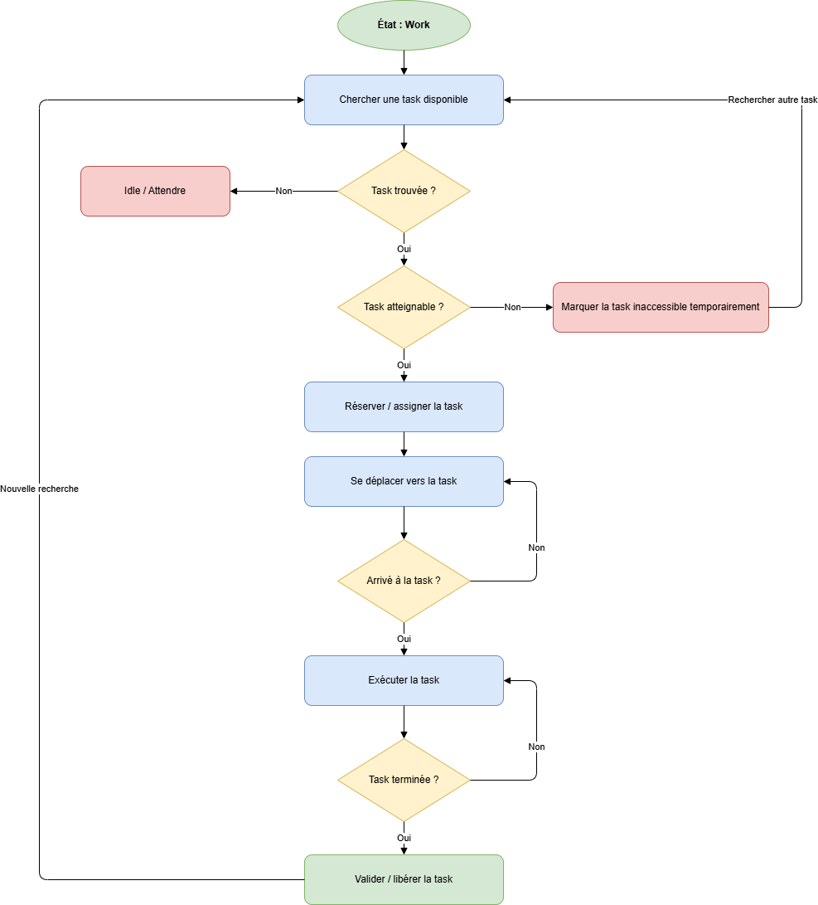
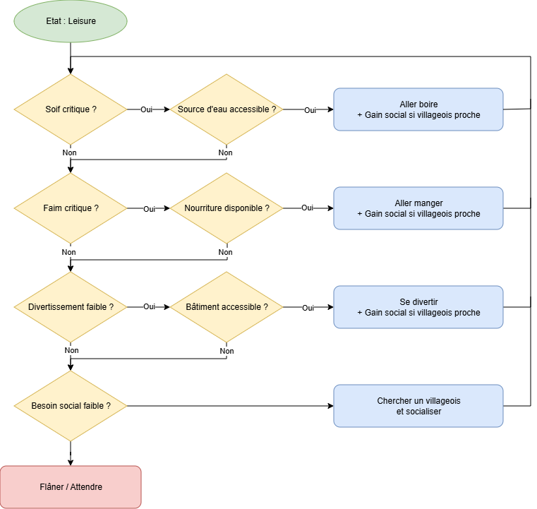

# Diogenes

## Game Overview

### Pitch

Project Diogenes est un jeu de gestion et de simulation de colonie en 2D sur grille où le joueur doit planifier le développement durable d'une cilisation atteint par le sydrome de Diogène. ils sont atteint d'une envie irresistible de tout recupèrer sur soi et de les garder chez eux. Les villageois prennent leurs propres décisions en fonction de leurs priorités, de leur emploi du temps et de leur environnement.

Le joueur agit davantage comme un architecte et un planificateur que comme un contrôleur direct, l'objectif principal est d'atteindre la surface.

## Synopsis


## Genre

- Colony Sim
- City Builder
- Gestion
- Simulation
- Sandbox

## Plateform Target

## Minimum Required Target

```{=typst}
#pagebreak()
```

# Piliers du Gameplay

## Colonie autonome

Les habitants prennent leurs propres décisions à partir des tâches disponibles, de leur emploi du temps et de leurs besoins.
Durant leur moment de pause les villageois iront satisfaire leurs besoins et dans un ordre d'importance

Leurs Besoins:

**1. La faim**

Normal: Si les villageois sont suffisamment affamé, ils doivent aller imperativement se nourrir.

**2. La soif**

Normal: Si les villageois sont on suffisamment assoiffé, ils doivent aller imperativement s'hydrater/se désaltérer.

**3. Le divertissement (Futur)**

Normal: Il y aura plusieurs moyen de divertir les villageois

- l'alcool
- les combats
- les jeux et paris
- autres...

**4. Le social**

Normal:
Les villageois effectue des pause a cotès de d'autre villageois rentre en communication, mais il y des chances que la discussion tourne au vinaigre. vérifié les différents point de vue politique ou culturel des villageois.
Certain batiments pour le divertissement qui reunisse les villagoies (exemple bar) peuvent aussi aider à satisfaire ce besoins

**5. La fatigue**

Normal:
Si les villageois sont suffisamment fatigué vont faire une sieste durant leurs pauses.

## Construction organique

Les bâtiments sont planifiés puis construits physiquement par les villageois.

## Réseaux techniques

Les infrastructures (électricité, ressources, transport) forment des réseaux interconnectés.

## Monde évolutif

Le monde se transforme progressivement selon les décisions du joueur et les actions des habitants.

```{=typst}
#pagebreak()
```

# Boucles de Gameplay

## Boucle principale

```text
Observer
↓
Planifier
↓
Créer des tâches
↓
Les villageois exécutent
↓
La colonie se développe
↓
Nouveaux besoins
↓
Observer
```


## Boucle de construction

```text
Placement d'un chantier
↓
Création d'une tâche
↓
Assignation de villageois
↓
Construction
↓
Bâtiment terminé
↓
Nouvelles possibilités
```

## Boucle d'infrastructure

```text
Construction
↓
Connexion au réseau
↓
Production
↓
Consommation
↓
Extension du réseau
```


## Boucle quotidienne

```text
Travail
↓
Temps libre
↓
Sommeil
↓
Nouvelle journée
```

```{=typst}
#pagebreak()
```

# 3C

## Character

Les villageois possèdent :

- Une position dans le monde
- Un emploi du temps
- Des tâches
- Des priorités
- Des besoins

### États principaux

- Idle
- Moving
- Working
- Sleeping
- Leisure


## Controls

Le joueur interagit principalement par :

- Placement de structures
- Planification de constructions
- Gestion des priorités
- Gestion des emplois du temps
- Gestion des réseaux techniques

Le joueur ne contrôle jamais directement les villageois.

## Camera

### Actuel

- Vue 2D orthographique
- Caméra libre
- Zoom

### Futur

- Zoom intelligent
- Focus sur événements
- Mode suivi de villageois

```{=typst}
#pagebreak()
```

# Systèmes

## Temps

### Cycle Jour/Nuit

Le temps est simulé.

Paramètres configurables :

- Heure de lever du soleil
- Heure de coucher du soleil
- Durée d'une journée


### Emploi du temps

Système inspiré de Oxygène not include.

### Activités

- Sleep
- Work
- Leisure

**Exemple**

```text
00-06 Sleep
06-08 Leisure
08-18 Work
18-22 Leisure
22-24 Sleep
```

## Villageois

### Travail

Les villageois :

- Cherchent une tâche
- Réservent une tâche
- Réservent une position de travail
- Se déplacent
- Exécutent la tâche

### Sommeil

Ordre de priorité :

**1. Lieu personnel**

Utiliser un emplacement de sommeil possédé.

**2. Lieu libre**

Chercher un emplacement libre puis le revendiquer.

**3. Sol**

Dormir à proximité d'autres villageois dormant au sol.


### Comportement futur

Behaviour Tree :

```text
Sleep
├─ Owned Spot
├─ Free Spot
└─ Ground Spot
```


## tâches

### Priorité

Valeur :

```text
1 → faible
9 → critique
```

### Types

#### Actuels

- Build

#### Futurs

- Haul
- Repair
- Harvest
- Craft
- Clean


### Réservation

Une tâche peut :

- Être libre
- Être réservée
- Être temporairement inaccessible
- Être terminée


## Construction

### Workflow

```text
Planification
↓
ConstructionSite
↓
Travail
↓
Progression
↓
Structure finale
```


### Multi-workers

Plusieurs travailleurs peuvent participer simultanément à un même chantier.


### Feedback visuel

#### Actuel

- Barre de progression
- Shine animé
- Positions de travail debug

#### Futur

- Animations
- Effets visuels
- États de construction


## Électricité

### Réseau

#### Producteurs

- Générateurs
- Panneaux solaires

#### Distribution

- Câbles
- Circuits

#### Consommateurs

- Lampes
- Machines

### Fonctionnalités

- Fusion de réseaux
- Séparation de réseaux
- Recalcul automatique

## Monde

### Génération procédurale

Pipeline de génération :

```text
Seed
↓
Terrain
↓
Structures
↓
Ressources
↓
Population
```


### Éditeur de carte

Fonctionnalités :

- Placement manuel
- Export
- Import
- Sauvegarde


## Intelligence Artificielle

### Actuel

Machine à états.

```text
Idle
Moving
Working
Sleeping
```


### Futur

Behaviour Tree.

#### Branches principales

```text
Root
├─ Emergency
├─ Sleep
├─ Work
└─ Leisure
```
{.diagram}
```text
Work
 └─ Chercher une task
     ├─ Aucune task trouvée
     │   └─ Idle / attendre
     │
     └─ Task trouvée
         └─ Vérifier atteignable
             ├─ Non atteignable
             │   └─ Ignorer temporairement puis chercher une autre task
             │
             └─ Atteignable
                 └─ Réserver la task
                     └─ Aller à la task
                         └─ Travailler
                             └─ Si terminé : chercher une nouvelle task
```
{.diagram}
```text
Selector (Leisure)

├── Sequence (Boire)
│   ├── NeedThirsty
│   ├── FindDrinkSpot
│   ├── IsAccessible
│   ├── MoveTo
│   └── Drink
├── Sequence (Manger)
│   ├── NeedHungry
│   ├── FindFood
│   ├── IsAvailable
│   ├── MoveTo
│   └── Eat
├── Sequence (Divertissement)
│   ├── NeedEntertainment
│   ├── FindLeisureBuilding
│   ├── IsAccessible
│   ├── MoveTo
│   └── Entertain
├── Sequence (Social)
│   ├── NeedSocial
│   ├── FindNearbyVillager
│   └── Socialize
└── Wander
```

```{=typst}
#pagebreak()
```

# Bâtiments

## Habitations

Les villageois devront posséder des lieux d'habitation afin d'habiter ou de cohabiter pour subvenir au mieux à leur confort et offrir de la sécurité. Il existera plusieurs niveaux de qualité d'habitation : taudis, maison, manoir.

## Taverne

Les villageois devront avoir un lieu où ils puissent se désaltérer, se divertir et développer leurs relations sociales. Le gain de social et de divertissement dépendra du nombre de villageois présents dans la structure.

## Monte-charge / Ascenseur

Les villageois pourront utiliser des structures facilitant et accélérant leurs déplacements ainsi que le transport de marchandises. Chaque installation possédera une charge maximale. Si cette limite est dépassée, la structure subira des dégâts. Une structure endommagée aura une faible probabilité de s'effondrer, provoquant des pertes matérielles et des blessures.

## Carrière

La carrière permet l'extraction de pierre, de roche et de matériaux de construction. Elle constitue la principale source de matériaux minéraux nécessaires à la construction de bâtiments avancés et d'infrastructures.

## Brasserie

La brasserie transforme les céréales et l'eau en bière. Cette dernière peut être consommée dans les tavernes afin d'améliorer le moral, le divertissement et le social des villageois.

## Hydromellerie

L'hydromellerie transforme le miel en hydromel. Cette boisson offre une alternative à la bière et participe également au divertissement et au bien-être des habitants.

## Maison des apiculteurs

La maison des apiculteurs gère les ruches environnantes et permet la production de miel et de cire. La qualité de l'environnement floral influence directement le rendement de la production.

## Ferme

La ferme constitue la principale source de nourriture du village. Elle produit différentes ressources agricoles selon les cultures choisies et les saisons. Son rendement dépend de la fertilité des sols et des conditions climatiques.

## Distillerie

La distillerie transforme diverses ressources agricoles ou fruitières en alcools forts. Ces produits peuvent être consommés ou utilisés dans certaines chaînes de production avancées.

## Camp de bûcherons

Le camp de bûcherons permet l'exploitation des forêts environnantes. Les bûcherons récoltent le bois nécessaire à la construction, au chauffage et aux différentes industries artisanales.

## Scierie

La scierie transforme les troncs d'arbres en planches et matériaux de construction. Elle améliore considérablement l'efficacité de l'utilisation du bois brut.

## Ébénisterie

L'ébénisterie transforme les planches en meubles et objets de qualité. Ces produits permettent d'améliorer le confort des habitations et la valeur globale du village.

## Atelier du forgeron

L'atelier du forgeron transforme les métaux en outils, clous, pièces métalliques et équipements divers. Il constitue la base du développement industriel du village.

## Fonderie

La fonderie transforme les minerais extraits des mines en lingots exploitables par les autres industries. Elle représente la première étape de la chaîne métallurgique.

## Armurerie

L'armurerie fabrique des armes, armures et équipements militaires destinés à la défense du village. La qualité de son équipement dépend des matériaux disponibles.

## Aciérie

L'aciérie transforme le fer et le charbon en acier. Ce matériau avancé permet la fabrication d'outils, d'armes et de structures de meilleure qualité.

## Charbonnerie

La charbonnerie transforme le bois en charbon de bois. Cette ressource est indispensable au fonctionnement des fonderies, forges et aciéries.

## Camp de mineur

Le camp de mineurs permet l'exploitation des gisements souterrains présents sur la carte. Les mineurs extraient différents minerais et ressources minérales nécessaires au développement du village. La productivité dépend de la richesse du gisement, de la profondeur de la mine et de la qualité des outils utilisés. Des risques d'effondrement ou d'accidents peuvent survenir si les galeries ne sont pas correctement entretenues.

## Camp de Forestier

Le camp de forestiers est chargé de la gestion et de l'exploitation durable des zones boisées. Les forestiers entretiennent les forêts, plantent de nouveaux arbres et identifient les ressources exploitables. Contrairement au camp de bûcherons qui se concentre sur l'abattage, le camp de forestiers assure le renouvellement des ressources forestières et améliore la santé des forêts environnantes. Une bonne gestion permet d'augmenter les rendements à long terme et de préserver l'environnement.

## Grenier

Le grenier est spécialisé dans le stockage des céréales et autres denrées sèches. Il protège efficacement les récoltes contre l'humidité et les nuisibles.

## Cave

La cave est utilisée pour le stockage du vin, de la bière, de l'hydromel et d'autres boissons. Les conditions de conservation améliorent la qualité de certains produits au fil du temps.

## Silo

Le silo permet le stockage de très grandes quantités de céréales. Il représente une amélioration avancée du grenier et sécurise les réserves alimentaires sur le long terme.

## Chambre froide

La chambre froide utilise des techniques de conservation avancées pour ralentir la détérioration des aliments. Elle augmente fortement la durée de conservation des ressources alimentaires.

## Trésor

Le trésor permet le stockage sécurisé de l'or, de l'argent et des objets de valeur. Il améliore la sécurité des richesses du village et réduit les risques de vol.

## Entrepôt

L'entrepôt permet de stocker de grandes quantités de ressources générales telles que le bois, la pierre, les outils ou les matériaux de construction. Il améliore l'organisation logistique du village.

## Cable éléctrique

## Générator

## Lampe (temporaire)

## Baterrie

## Pompe Manuel

## Pompe éléctique

## tuyaux

## bouche d'évacutation

## filtre

## Puits

## Fontaine

## Douane

## Clinique

## Hopital

## Milice

## Tour de Guet

## Artificier

## Pompier

## Plateform

## Escalier

## Echelle

## Pont levis

## Mur

## Roue hydrolique


# Interface Utilisateur

# Direction Artistique

# Audio

## Ambiances

## Musiques

## Effets sonores

# Roadmap

## Prototype

- Construction
- Pathfinding
- Priorités
- Électricité
- Jour/Nuit
- Emploi du temps

## Alpha

- Sommeil
- Besoins
- Récolte
- Transport

## Beta

- Production
- Économie
- Événements

## Release

- Équilibrage
- Contenu
- Polish
