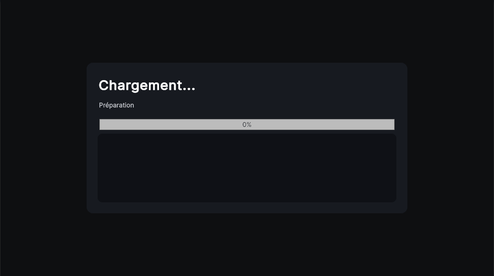
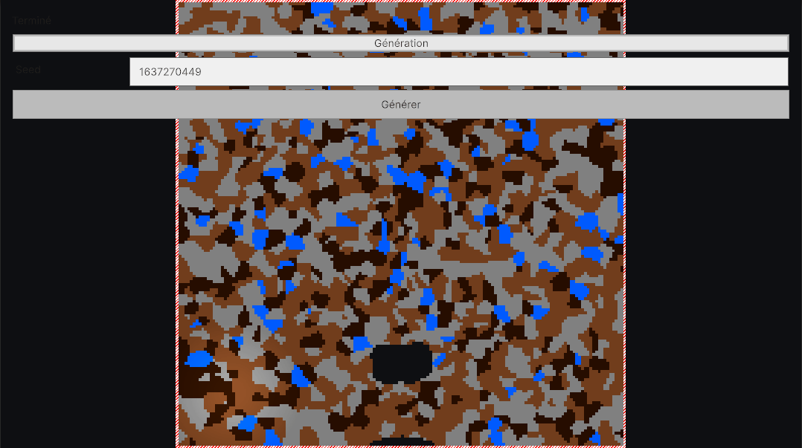
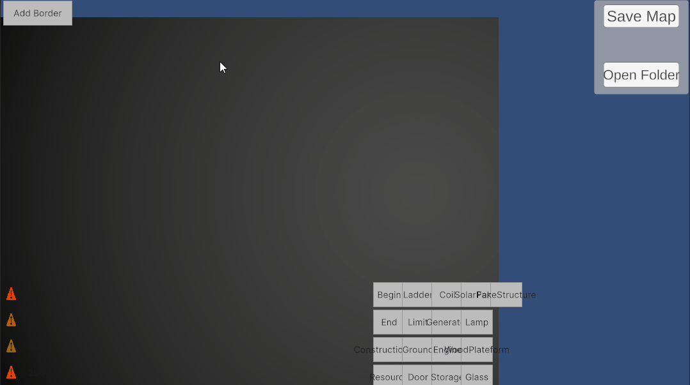
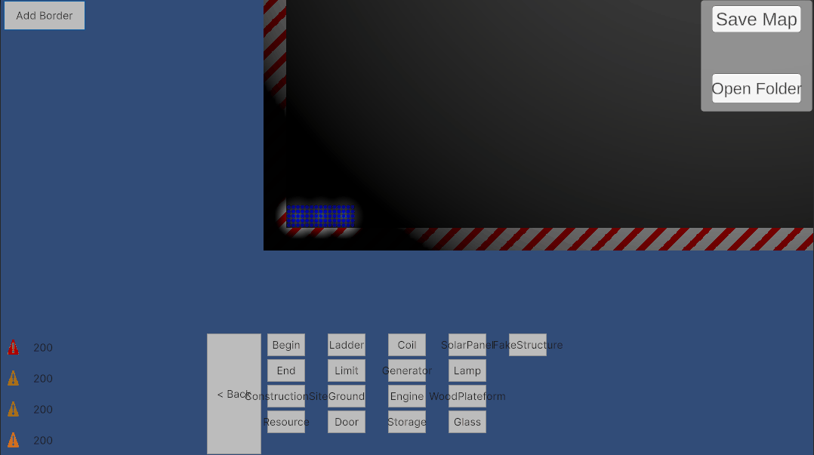

[](https://creativecommons.org/licenses/by-nc/4.0/)

# 🚀 Diogenes Project

## 🧠 Présentation

**Diogenes Project** est un prototype de jeu développé sur Unity.  
Je m’en sers principalement pour expérimenter différents systèmes comme la génération procédurale, le pathfinding et la gestion d’un monde basé sur une grille.

L’idée derrière ce projet, c’est moins de faire un “jeu fini” que de construire des bases techniques solides, réutilisables et évolutives.

---

## 🎮 Fonctionnalités principales

### 🌍 Génération procédurale
La map est générée via une pipeline composée de plusieurs étapes indépendantes.  
Chaque génération peut être reproduite grâce à un système de seed.

J’ai aussi ajouté une interface avec UI Toolkit pour modifier les paramètres (seed, génération, etc.) directement en jeu.

---

### 🧭 Pathfinding
Le pathfinding est basé sur un A*, mais adapté aux contraintes du jeu.

Par exemple :
- déplacement horizontal
- montée sur certains blocs
- utilisation d’échelles pour atteindre différentes hauteurs

Le but était d’avoir un système qui respecte les règles du gameplay, pas juste un algo théorique.

---

### ⚙️ Système de chargement
Le loading est découpé en plusieurs étapes, chacune avec un poids.  
Cela permet d’avoir une progression globale plus représentative.

Chaque étape communique avec un système de reporting pour mettre à jour l’interface en temps réel.

---

### 💾 Sauvegarde / chargement
Le monde peut être sauvegardé et chargé via un système JSON.

J’ai structuré cela avec des classes dédiées pour garder quelque chose de propre et extensible.

---

## 🧩 Organisation du projet

J’ai essayé de garder une structure claire :

- `Map` → gestion du monde  
- `Pathfinding` → navigation  
- `Loading` → initialisation  
- `Input / Controller` → contrôles  
- `UI` → interface  
- `Manager` → logique globale  

---

## 🏗️ Approche technique

Sur ce projet, j’ai surtout voulu travailler sur :
- la séparation des responsabilités  
- des systèmes modulaires (pipeline, steps, interfaces)  
- éviter les scripts monolithiques  

Par exemple :
- la génération fonctionne par étapes indépendantes  
- le loading suit le même principe  
- le pathfinding intègre directement les règles du jeu  

---

## 🛠️ Technologies

- Unity (C#)  
- UI Toolkit  
- JSON pour la sauvegarde  
- ScriptableObjects pour la configuration  

---

## ▶️ Lancer le projet

```bash
git clone https://github.com/AbominableSandwish/DiogenesProject.git
```
## 🎥 Aperçu


🔌 Système électrique (circuits)

👉 Mise en place d’un système de circuits dynamiques :

Un générateur produit de l’énergie
Les câbles (coils) transportent le courant
Les lampes s’activent lorsqu’elles sont connectées

Le réseau se met à jour automatiquement :

création de circuits
fusion de réseaux
séparation lors de suppression



📦 Chargement des assets (Addressables)

👉 Mise en place du système de chargement via les Addressables de Unity :

Chargement des assets de manière asynchrone
Suivi de la progression en temps réel
Interface de chargement avec barre de progression

Ce système permet une meilleure gestion des ressources et prépare le projet pour des scènes plus complexes.



🗺️ Génération procédurale de la map

👉 Mise en place d’un système de génération basé sur un pipeline :

Génération contrôlée via une seed
Enchaînement de différentes étapes (steps)
Résultat modulable et reproductible

Chaque étape du pipeline permet de transformer progressivement la map, ce qui rend le système flexible et facile à étendre.



🛠️ Éditeur de map

👉 Mise en place d’un éditeur permettant de construire la map directement :

Placement manuel des structures sur la grille
Interface simple pour tester rapidement des configurations
Export et import des maps

Cet outil facilite énormément le debug et la création de scénarios spécifiques.



🏗️ Planification de construction

👉 Mise en place d’un système de planification des constructions :

Placement de ConstructionSite sur la grille
Les villageois détectent les tâches de construction
Déplacement jusqu’au site puis interaction
Progression de la construction au fil du temps

Ce système permet de séparer la planification (ce que le joueur veut construire) de l’exécution (les villageois qui réalisent).

## 🔍 Technical Highlights

- Pipeline de génération modulaire (ScriptableObject + Steps)
- Système de loading pondéré avec progression globale
- Pathfinding avec contraintes gameplay (climb, ladder, obstacles)
- Architecture orientée systèmes et découplage
